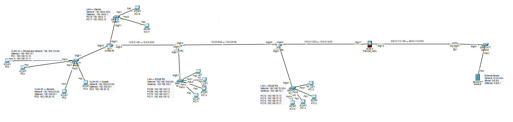
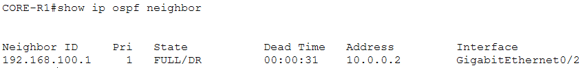
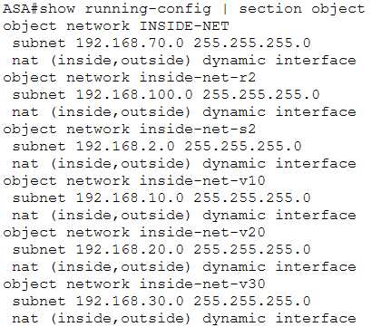
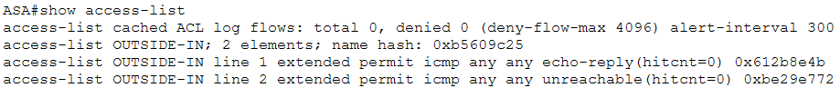
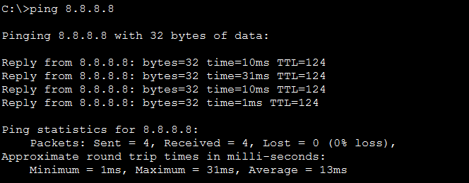

# Company Network — Cisco Packet Tracer

## Project Overview

This project is a realistic enterprise network designed and implemented using Cisco Packet Tracer.

The goal of the project is to simulate a small company's network infrastructure, including network segmentation, routing, security, NAT/PAT, and firewall configuration.

## Project Highlights

* Designed a multi-router enterprise network topology.
* Implemented VLAN segmentation for Employees, Servers, and Guests.
* Configured Router-on-a-Stick for inter-VLAN routing.
* Implemented DHCP for multiple internal networks.
* Configured OSPF for dynamic routing between network devices.
* Implemented NAT/PAT on Cisco ASA.
* Configured ASA firewall rules and outside ACLs.
* Implemented SSH-based device management.
* Configured switch Port Security with sticky MAC addresses.
* Tested and troubleshot end-to-end connectivity.

## Technologies Used

* Cisco Packet Tracer
* VLANs
* 802.1Q Trunking
* Router-on-a-Stick
* DHCP
* ACLs
* SSH
* Port Security
* OSPF
* NAT/PAT
* Cisco ASA Firewall
* Static Routing
* ICMP

## Network Topology


## Network Design

### VLANs and Internal Networks

| Network          | Purpose             | Gateway       |
| ---------------- | ------------------- | ------------- |
| 192.168.10.0/24  | VLAN 10 — Employees | 192.168.10.1  |
| 192.168.20.0/24  | VLAN 20 — Servers   | 192.168.20.1  |
| 192.168.30.0/24  | VLAN 30 — Guests    | 192.168.30.1  |
| 192.168.2.0/24   | Internal LAN        | 192.168.2.1   |
| 192.168.100.0/24 | EDGE-R2 LAN         | 192.168.100.1 |
| 192.168.70.0/24  | EDGE-R3 LAN         | 192.168.70.1  |

### Router-to-Router Links

| Link              | Network        |
| ----------------- | -------------- |
| CORE-R1 ↔ EDGE-R2 | 10.0.0.0/30    |
| EDGE-R2 ↔ EDGE-R3 | 10.0.0.4/30    |
| EDGE-R3 ↔ ASA     | 10.0.0.12/30   |
| ASA ↔ ISP         | 203.0.113.0/30 |

### External Network

* Server network: `8.8.8.0/24`
* Server: `8.8.8.8`
* Gateway: `8.8.8.1`
## Routing

OSPF was used as the dynamic routing protocol between the routers and the ASA/ISP segment.

The network was divided into multiple routed segments using /30 point-to-point links.

## Security

The project includes several network security mechanisms:

* VLAN segmentation
* Guest network isolation using extended ACLs
* SSH-based device management
* Console and privileged-access protection
* Switch Port Security with sticky MAC addresses
* Port Security violation shutdown
* Cisco ASA security zones
* NAT/PAT on the ASA
* Outside ACL permitting required ICMP return traffic

### Guest Network Policy

The Guest VLAN is prevented from directly accessing:

* Employee network: `192.168.10.0/24`
* Server VLAN: `192.168.20.0/24`

Other traffic is permitted according to the configured ACL policy.

### Port Security

Access ports were protected using:

* Maximum one secure MAC address
* Sticky MAC learning
* Shutdown violation mode

A Port Security violation was intentionally tested and the affected port was successfully recovered.
## NAT/PAT

NAT/PAT was configured on the Cisco ASA to translate internal private networks when accessing the external network.

The ASA performs dynamic PAT using its outside interface address.

Internal networks include:

* `192.168.2.0/24`
* `192.168.10.0/24`
* `192.168.20.0/24`
* `192.168.30.0/24`
* `192.168.70.0/24`
* `192.168.100.0/24`

## Troubleshooting

During testing, ICMP requests successfully reached the external server, but the return traffic was initially dropped at the ASA.

Routing and NAT were verified first.

The issue was resolved by applying an inbound ACL on the ASA outside interface:

```text
access-list OUTSIDE-IN extended permit icmp any any echo-reply
access-group OUTSIDE-IN in interface outside
```

After applying the ACL, end-to-end ICMP connectivity was successfully established between the internal networks and the external server.

## What I Learned

Through this project, I practiced:

* Designing an enterprise-style network topology
* VLAN segmentation
* Router-on-a-Stick
* DHCP configuration
* Inter-VLAN routing
* Extended ACLs
* OSPF dynamic routing
* NAT/PAT
* Cisco ASA firewall configuration
* SSH device management
* Switch Port Security
* Network troubleshooting using packet flow and simulation
## Verification

### OSPF



### NAT/PAT



### ASA Firewall ACL



### End-to-End Connectivity



## Project Status

**Completed**

The network was implemented, secured, tested, and documented using Cisco Packet Tracer.

This project is part of my practical networking portfolio and focuses on enterprise network design, routing, security, NAT/PAT, and troubleshooting.
